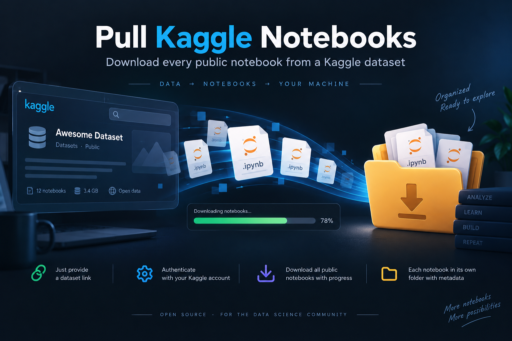

# pull-kaggle-notebooks



Download every public notebook attached to a Kaggle dataset, with a live progress UI.

## Features

- Just provide a dataset link — no need to look up individual notebook URLs
- Authenticates with your own Kaggle account (username + API key)
- Downloads all public notebooks for the dataset, with a live progress bar
- Each notebook is saved to its own folder, along with its metadata

## Setup

```bash
pip install -r requirements.txt
```

You need a Kaggle API key. Get one at https://www.kaggle.com/settings -> API -> "Create New Token". This gives you a username and key (found inside the downloaded `kaggle.json`).

## Run

```bash
python pull_kaggle_notebooks.py
```

You'll be prompted for:
- **Dataset link or slug** — e.g. `https://www.kaggle.com/datasets/owner/dataset-name` or just `owner/dataset-name`
- **Kaggle username**
- **Kaggle API key**
- **Download directory** — defaults to `./kaggle_notebooks`

## Output

Each notebook is saved to its own subfolder inside the download directory, named after its
`owner_notebook-slug`, containing the notebook file and its metadata:

```
kaggle_notebooks/
├── owner1_notebook-one/
│   ├── notebook-one.ipynb
│   └── kernel-metadata.json
└── owner2_notebook-two/
    ├── notebook-two.ipynb
    └── kernel-metadata.json
```
